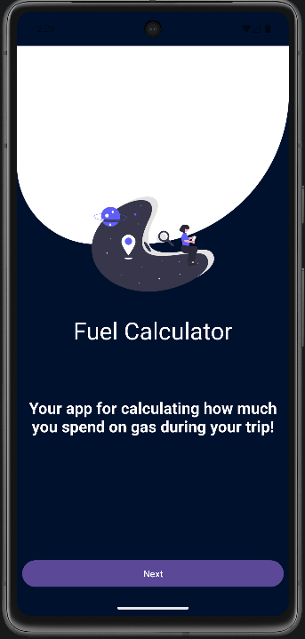
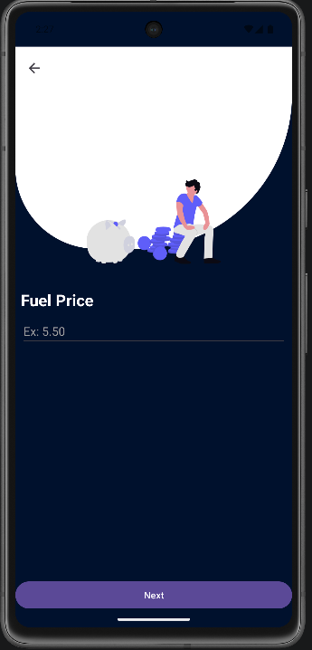
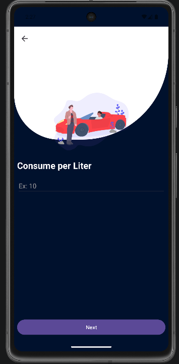
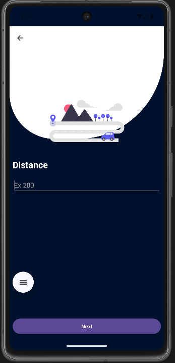
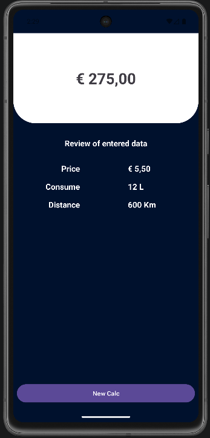

# Fuel Calculator App

A simple Android application built with Kotlin to calculate the estimated fuel cost of a trip.

The app allows the user to enter the fuel price, vehicle consumption, and trip distance. After that, it displays the estimated total cost of the trip.

## Features

- Calculate estimated fuel cost for a trip
- Enter fuel price per liter
- Enter vehicle fuel consumption
- Enter trip distance
- Display the final result with Euro and kilometer formatting
- Simple multi-screen navigation
- Clean and minimal user interface

## Technologies Used

- Kotlin
- Android Studio
- XML Layouts
- Intent navigation

## Screenshots

| Main Screen | Fuel Price | Consumption |
|---|---|---|
|  |  |  |

| Distance | Result |
|---|---|
|  |  |

## App Flow

1. The user starts on the main screen.
2. The user enters the fuel price.
3. The user enters the vehicle consumption.
4. The user enters the trip distance.
5. The app calculates and displays the estimated travel cost.

## Project Structure

```text
FuelCalculator/
├── app/
├── screenshots/
│   ├── Mainscreen.png
│   ├── FuelPrice.png
│   ├── Consumption.png
│   ├── Distance.png
│   └── Result.png
├── README.md
├── build.gradle.kts
└── settings.gradle.kts